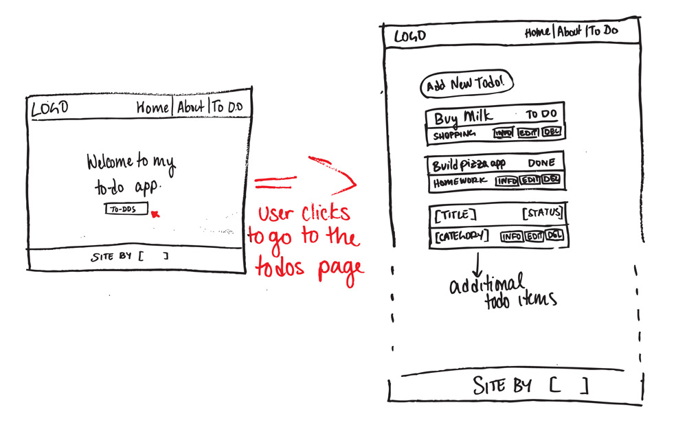
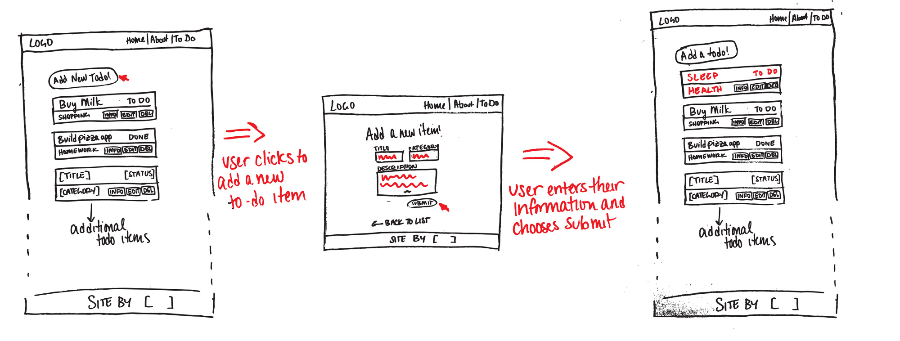
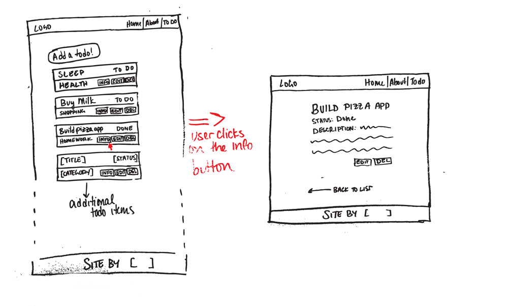
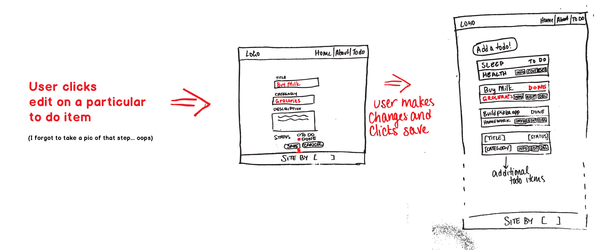
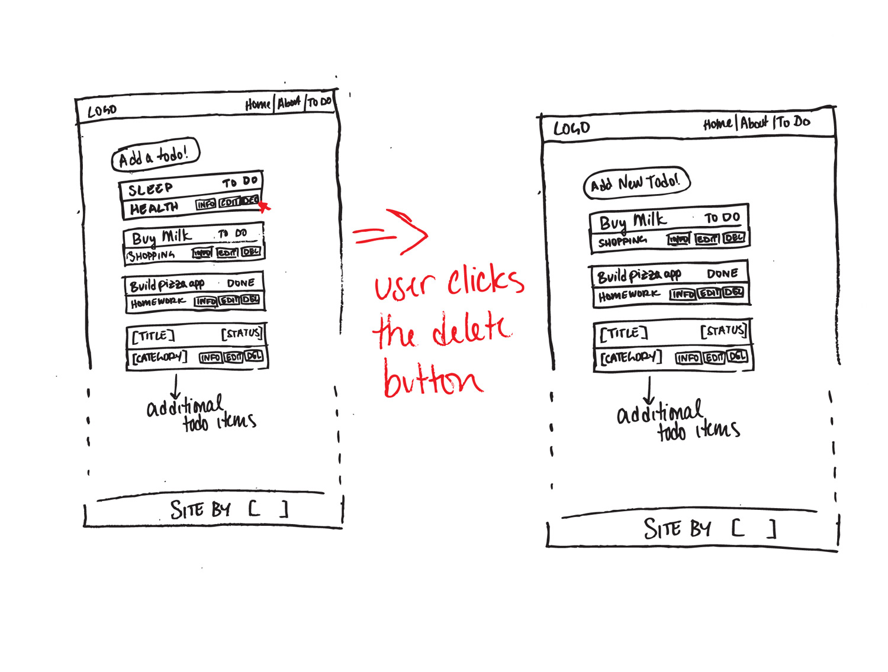

# Initial Approach

To begin a MVC application, there are a few steps that I would call, *'The Foundations of a MVC app'*, that need to be planned out and created before getting into the core logic of the app. These foundations that need to be planned is as follows: 

#### Foundations of a MVP app:
- Database (**M**)
- Views (**V**)
- Server (**C**)


<br>


#### Quick Links:

[Installing the App](#installing-the-app)

[Technologies Used](#technologies-used)

[Planning the App](#planning-the-app)
- [Creating the Database](#creating-the-database)
- [Creating the Views](#creating-the-views)
- [Configuring the Server](#configuring-the-server)


<br>


## Installing the App

### Requirements:

- node version: `>=v8.2.1`

- npm version: `>=5.3.0`

- Have postgresSQL installed and running on your machine.


First fork and clone `git clone <fork url>` into a directory of your chose.

Run `npm install` to install the project's dependencies.

Run `npm run setup` which will create and popluate a postgres database.

After, run `npm run start` to start the server.


<hr>
<br>


## Technologies Used
---
#### Database:
Technology | Description
--- | ---
Postgres |  A powerful, open source object-relational database system to store data.
pg-promise | The nodejs driver to connect to the Postgres database.


<br>


#### Views:
Technology | Description
--- | ---
HTML | The structure of a web page
CSS | Provide styling to the HTML of a web page.
EJS | The templating engine that generates the HTML with a template and its data on the server.
Javascript | Allowing a web page to be interactive by allowing additional functionality to the web page.


<br>


#### Server:
Technology | Description
--- | ---
Node.js | The server that is a javacsript client side runtime that allows javacsript to run outside of the browser.
Express.js | A Node.js framework that makes using Node.js as a server more developer friendly.


<br>


## Planning the app:

### Creating the Database

To start creating the todo app, the database structure for storing each todo was thought out. Our todo would have the following fields:

- Title
- Completion Status
- Category
- Description


<br>


### Creating The Views

The views are what the client will be seeing and interfacing with. Therefore, **wireframes were used to mockup how a user would interact with the completely todo app**. The wireframes allow for testing user stories to see whether or not any idea for the app is feasible. The following wireframes were used to guide this app:


<br>


#### Landing on the home page and going to the to-do page



#### Adding a todo



#### Getting info from a todo



#### Editing a todo



#### Deleting a todo


<br>

### Configuring the Server

The server will have to listen to different routes for any requests from the client and appriopriately handle that request. For the todo app, the public routes that the user will be able to request will be **based on the wireframes above**:

```node
    // Home Page
    GET /
    
    // About Page
    GET /about
    
    // Display all todos
    GET /todos
    
    // Disply a single todo with its description
    GET /todos/:id
    
    // Add/Create todo
    POST /todos/add
    
    // Edit Todo
    GET /todos/edit/:id // render the edit page
    PUT /todos/:id

    // Delete Todo
    DELETE /todos/:id

```
To allow the user to manipulate the todos, routes for handling `CREATE`, `EDIT` and `DELETE` todos were created. The `DELETE` route however, does not need a new view and will redirect the user back to the `/todos` which displays all todos.
