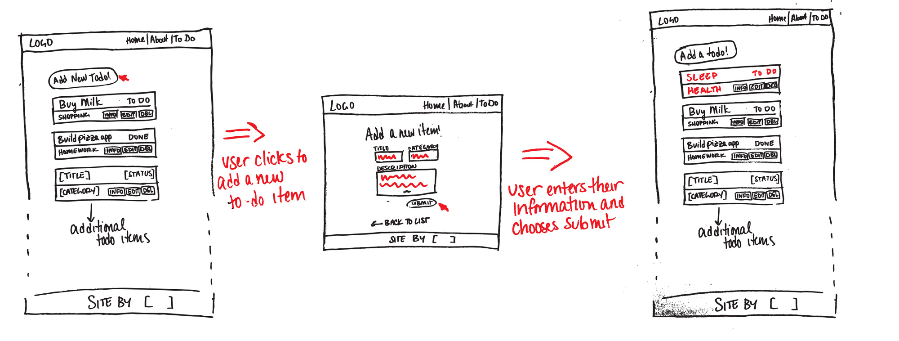
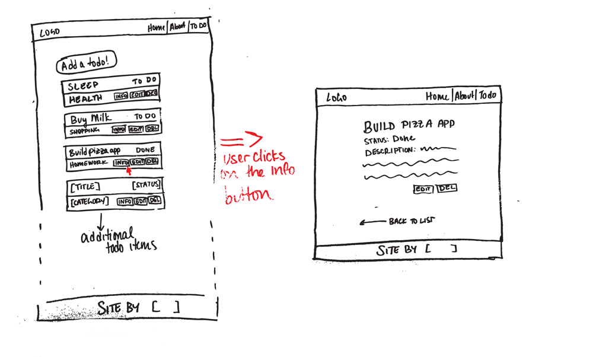
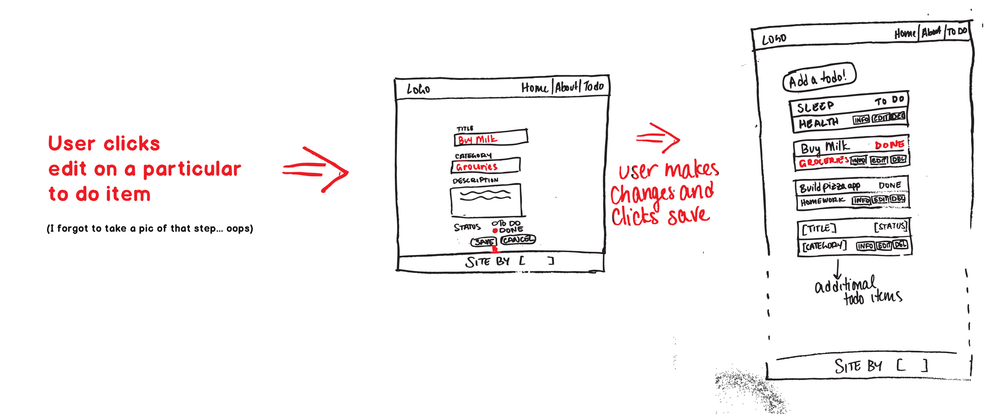
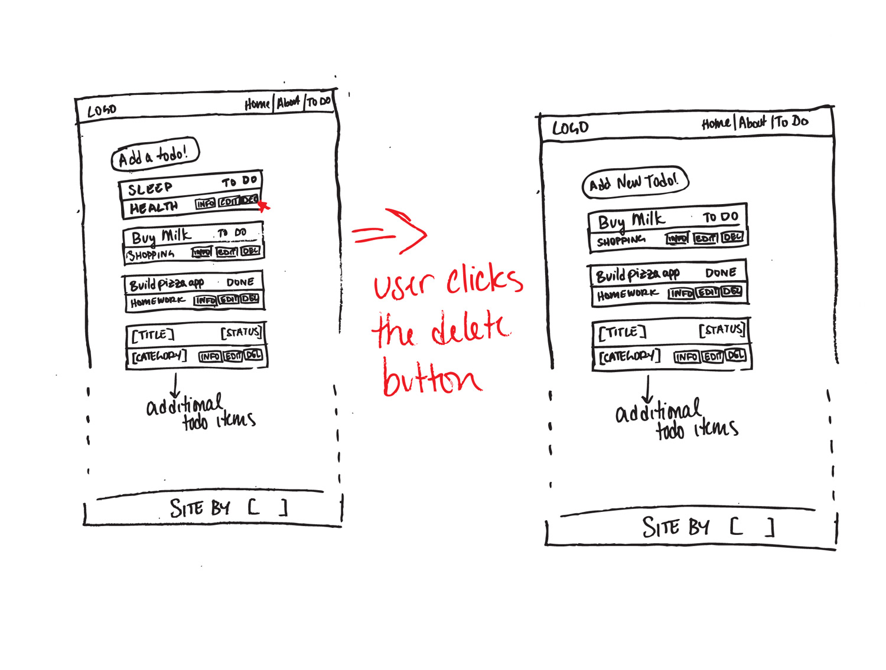

# Initial Approach

To begin a MVC application, there are a few steps that I would call 'The Foundations of a MVC app' that need to be planned and created before getting into the core logic of the app. These foundations are the: 

#### Foundations of a MVP app:
- Database (**M**)
- Views (**V**)
- Server (**C**)

### Technologies Used

<br>
**Database:**
Technology | Description
--- | ---
Postgres |  A powerful, open source object-relational database system to store data.
pg-promise | The nodejs driver to connect to the Postgres database.

**Views:**
Technology | Description
--- | ---
HTML | The structure of a web page
CSS | Provide styling to the HTML of a web page.
EJS | The templating engine that generates the HTML with a template and its data on the server.
Javascript | Allowing a web page to be interactive by allowing additional functionality to the web page.

**Server:**
Technology | Description
--- | ---
Node.js | The server that is a javacsript client side runtime that allows javacsript to run outside of the browser.
Express.js | A Node.js framework that makes using Node.js as a server more developer friendly.
<br>

## Planning the app:

### Creating the Database

To start creating the todo app, the database structure for storing each todo was though out. Our todo would have the following attributes:

- Title
- Completion Status
- Category
- Description
<br>

### The Views

The views are what the client will be seeing and interfacing with. Therefore, wireframes were used to mockup how a user would interact with the completely todo app. The wireframes allow for testing user stories to see whether or not any idea for the app is feasible. The following wireframes were used to guide this app:

#### Landing on the home page and going to the to-do page


#### Adding a todo



#### Getting info from a todo



#### Editing a todo



#### Deleting a todo


<br>

### Configuring the Server

The server will have to listen to different routes for any requests from the client and appriopriately handle that request. For the todo app, the public routes that the user will be able to request will be based on the wireframes above:

```node
    // Home Page
    /
    
    // About Page
    /about
    
    // Display all todos
    /todos
    
    // Disply a single todo with its description
    /todos/:id
    
    // Add/Create todo
    /todos/add
    
    // Edit Todo
    /todos/edit/:id
```
To allow the user to manipulate the todos, routes for handling CREATE, EDIT and DELETE todos were created. The DELETE route does not need a new view and will redirect the user back to the `/todos` which displays all todos.
